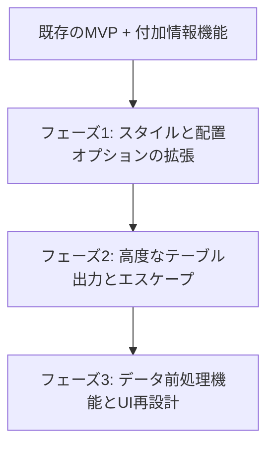

# Excel2TeX 拡張機能実装ロードマップ (Extended Features Implementation Roadmap)

本ドキュメントは、[Excel2TeX 拡張機能仕様書](file:///C:/Python/Excel2TeX/inside-docs/extended-features/extended_specification.md) に定義された各種機能を、段階的に実装・検証していくための計画を定義する。

---

## 1. 現状の整理と課題

### 1.1 実装済みの機能 (MVP + α)
*   CSV/Excelのファイル読み込みとパース (Pandas)
*   基本的な `tabular` 環境での変換ロジック
*   右ペインでのリアルタイムプレビューとクリップボードコピー
*   **付加情報設定機能 (実装完了)**
    *   キャプション (`\caption{}`) とラベル (`\label{}`) の指定
    *   UI（Additional Info パネル）からのリアルタイム反映

### 1.2 主な課題
1.  **LaTeX 特殊文字の非エスケープ**: データやキャプションに `&` や `_` が含まれているとコンパイルエラーになる。
2.  **スタイリングオプションの不足**: 罫線の引き方や太字化、テーブル環境の切り替えができない。
3.  **UI項目の乱雑化**: 設定項目がこのまま増えると、UIの視認性（近接の法則・類同の法則）が低下する。

---

## 2. 段階的実装計画 (Phased Implementation Plan)

開発効率と動作確認のしやすさを考慮し、3つのフェーズに分けて実装を行う。

### 2.1 フェーズ1: スタイルと配置オプションの拡張 (Styling & Alignment)
比較的容易に実装でき、表の見栄えに直接影響する設定項目を追加する。

1.  **テキスト配置とテーブル配置**:
    *   セル内の配置指定 (`l`/`c`/`r`) のグローバル切り替え。
    *   テーブル自体の配置 (`\centering` 等) のトグル。
2.  **太字化オプション**:
    *   最初の行（ヘッダー）と最初の列の `\textbf{...}` 化。
3.  **フロート位置指定**:
    *   `\begin{table}[ht]` などのパラメータ設定オプション。

*   **検証項目**:
    *   各オプションの切り替えがリアルタイムプレビューに正しく反映されること。
    *   `test_converter.py` に各オプションの組み合わせテストを追加。

---

### 2.2 フェーズ2: 高度なテーブル出力とエスケープ (Advanced LaTeX & Safety)
LaTeXとしてのコンパイル品質とエラー防止を高めるためのロジックを実装する。

1.  **特殊文字のエスケープ処理**:
    *   文字列処理ヘルパーを追加し、セル値やキャプション中の特殊文字 (`%`, `&`, `_`, etc.) をエスケープ。
2.  **境界線スタイル (Borders Style)**:
    *   `All`/`Horizontal`/`None`/`booktabs` などの罫線引き分けロジックの実装。
3.  **テーブルタイプ (Table Type)**:
    *   `tabular` 以外の `longtable` や `tabularx` への切り替え処理。
4.  **完全なドキュメント (MWE) モード**:
    *   `\documentclass` 等を含めた出力切り替え。

*   **検証項目**:
    *   エスケープされたコードが実際のLaTeX環境で正しくコンパイルできるか。
    *   `longtable` や `tabularx` のパッケージ利用宣言がMWEモード時に自動で挿入されるか。

---

### 2.3 フェーズ3: データ前処理機能とUI再設計 (Preprocessing & UX Improvement)
データの加工と、項目が多くなったGUIの再設計・使いやすさの向上を行う。

1.  **行列の転置 (Transpose) 機能**:
    *   UIに「転置」ボタンを設け、Pandas `DataFrame` を転置して再プレビュー。
2.  **データクリーニング・テキスト変換**:
    *   大文字・小文字変換、空行削除等の前処理ロジックの追加。
3.  **ゲシュタルトの法則に基づくUI再設計**:
    *   Flet UIをタブやセクション（コンテナと枠線）でグループ化し、関連する設定を近接して配置。
4.  **ファイルダウンロード機能**:
    *   `.tex` ファイルとしてローカルに保存できる機能を追加。

*   **検証項目**:
    *   Fletでのダイアログ操作によるファイル保存が正しく機能するか。
    *   転置した後に、キャプションやスタイルの設定が正しく適用されるか。

---

## 3. テストと品質管理計画

各フェーズの実装において、以下の品質チェックを自動化および手動で実施する。

1.  **単体テストの拡張**:
    *   `tests/test_converter.py` に新しいオプション（`escape`, `borders`, `table_type`, `transpose`等）のテストケースを追加。
2.  **コード品質 (Lint/Format)**:
    *   `uv run ruff check .` および `uv run ruff format .` の実行。
3.  **実機スモークテスト**:
    *   Windows/macOS環境にて、GUIが正しく表示され、ボタン操作によって例外エラーが発生しないことを確認。
